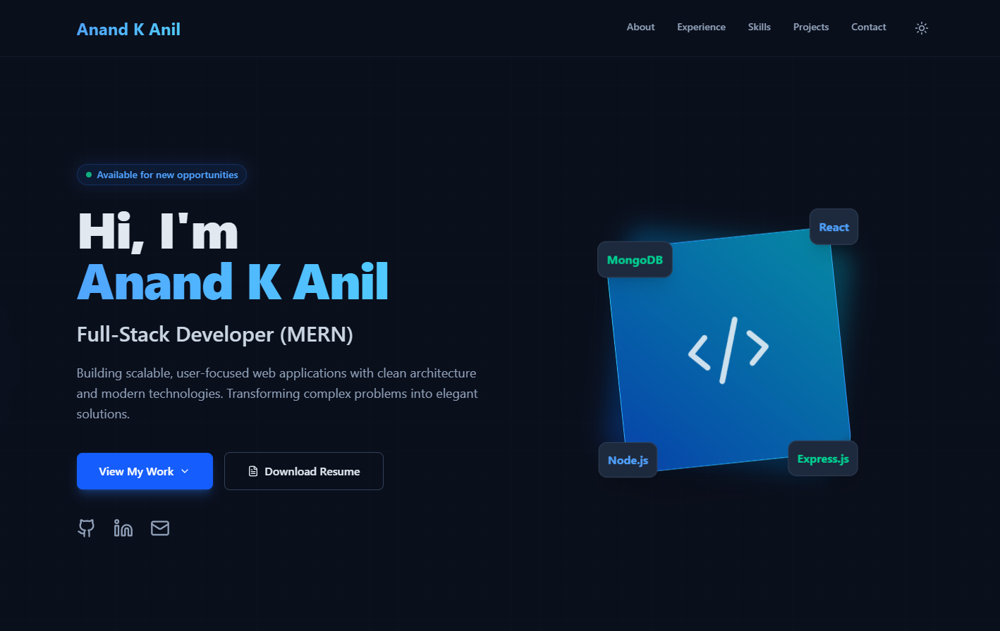

# 🌐 Anand K Anil — Developer Portfolio

This repository contains the source code for my **personal portfolio website**, built to showcase my projects, technical skills, and professional experience as a **Full-Stack Developer (MERN Stack)**.

🔗 **Live Website**  
https://anandkanil-portfolio.netlify.app/

🔗 **GitHub Repository**  
https://github.com/Anandkanil/portfolio

---

## 📸 Portfolio Preview



---

## 🚀 About The Project

This portfolio website was designed and developed to present my work, technical expertise, and projects in a clean, modern, and interactive format.

The website highlights:

• Professional introduction  
• Technical skills and tools  
• Work experience  
• Featured development projects  
• Contact form integration  
• Responsive design for all devices  

The goal of this project is to demonstrate my ability to build **modern full-stack applications with scalable architecture and polished UI/UX design**.

---

## 🛠 Tech Stack

### Frontend
- React.js
- Tailwind CSS
- JavaScript (ES6+)
- Lucide Icons

### Services
- EmailJS (Contact Form Integration)

### Deployment
- Netlify

### Tools
- Git
- GitHub
- VS Code

---

## 📂 Project Structure


portfolio
│
├── public
│
├── src
│ ├── components
│ ├── App.jsx
│ └── main.jsx
│
├── package.json
├── vite.config.js
└── README.md


---

## ⭐ Featured Projects

### 📚 StudyNotion — EdTech Platform
A full-stack learning platform featuring authentication, course management, and secure user workflows.

**Tech Stack**  
React • Node.js • Express • MongoDB • JWT

---

### 🔄 Sorting Visualizer
Interactive visualization tool for understanding sorting algorithms and how they work internally.

**Tech Stack**  
JavaScript • React

---

### 💳 Razorpay Landing Page Clone
A pixel-perfect clone of the Razorpay website built using Tailwind CSS to demonstrate UI replication and responsive layout design.

**Tech Stack**  
HTML • Tailwind CSS • JavaScript

---

## ⚙️ Installation & Setup

Clone the repository

```bash
git clone https://github.com/Anandkanil/portfolio.git

Navigate to the project directory

cd portfolio

Install dependencies

npm install

Run the development server

npm run dev
🌍 Deployment

The portfolio website is deployed using Netlify.

Live URL:

https://anandkanil-portfolio.netlify.app/

📬 Contact

Anand K Anil

📧 Email
ktmanand@gmail.com

🔗 LinkedIn
https://linkedin.com/in/anand-k-anil-96b717211

💻 GitHub
https://github.com/Anandkanil

📄 License

This project is open source and available under the MIT License.